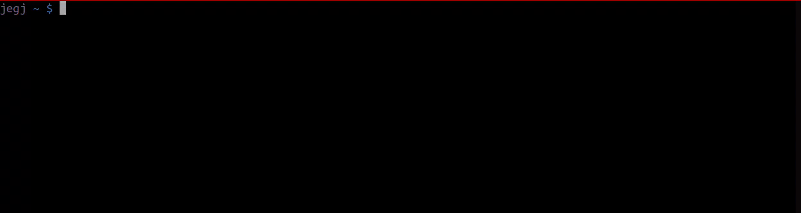

[](https://github.com/jegj/protondb-cli/actions/workflows/build.yml)
[](https://standardjs.com/)
[](https://www.npmjs.com/package/protondb-cli)
[](https://www.npmjs.com/package/protondb-cli)

# protondb-cli
A simple CLI for [ProtonDB project](https://www.protondb.com/).
Let's face it, if you know about ProtonDB you must love video
games and Linux and what better than an CLI for a Linux fan
to check your games compatibility on Steam.



## Installation
```bash
npm i protondb-cli -g
```
## Usage

```
protondb-cli "Counter strike"
```

### Tiers
Describe the support on Linux with ProtonDB

| Tier      | Description                                                               |
| :-------- | :------                                                                   |
| Platinum  | Runs perfectly out of the box                                             |
| Gold      | Runs perfectly after tweaks                                               |
| Silver    | Runs with minor issues, but generally playable                            |
| Bronze    | Runs, but often crashes or has issues preventing from playing comfortably |
| Borked    | Either won't start or is crucially unplayable                             |
| N/A       | Wihtout Tier. Comunity haven't report this game yet                       |


### Confidence
Describe the support of the community under the tier

## Using Docker

```sh
$ docker run -it --rm jegj/protondb-cli fifa
```
## How ProtonDB.com works
For more information about how [ProtonDB](https://www.protondb.com/)
works, check the [protondb specification](./docs/protondb.md).

## How protondb-cli works
We use the information that you can find out in [ProtonDB web page](https://www.protondb.com/)
 to emulate the HTTP requests, parse and show the results.
### Limitations
- Keys, id and urls may change in the future. That is why those kind
 of params can be provided to the CLI. Perhaps in the future there
  is a better way to support this changes...
